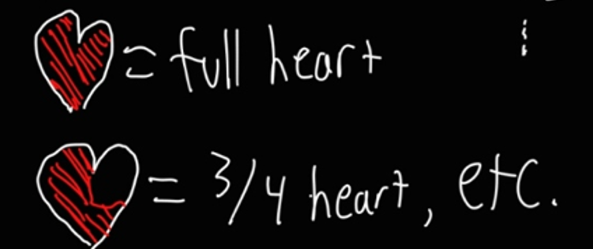
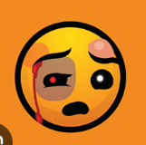
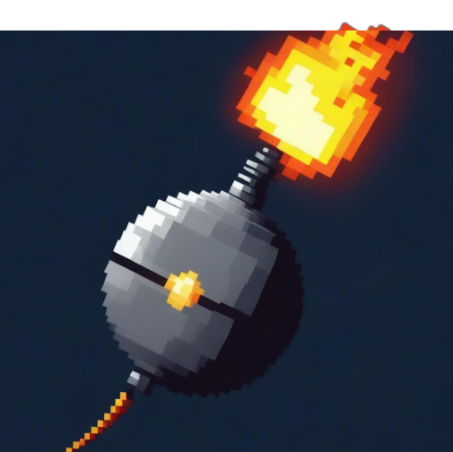
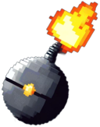

## Summary ##

PunchHell is a Touhou-style Danmaku (bullet hell) game, also known as a "shoot em' up." PunchHell takes inspiration and plays like many other shoot em' up games: a character is stationed on a stage that might appear to be scrolling vertically (or horizontally, as some games do it) and enemies spawn on the screen and approach the player's character in the stage. The enemies then spawn projectiles into the stage with varying behavior based on what sort of attacks that they were programmed to make. The player's goal is to dodge these bullets, kill the enemies with their own projectiles, and progress through the stages which present a variety of enemies to encounter and a variety of bullet patterns to dodge.

## Project Resources

[Web-playable version of your game.](https://itch.io/)  
[Trailor](https://youtube.com)  
[Press Kit](https://dopresskit.com/)  
[Proposal: make your own copy of the linked doc.](https://docs.google.com/document/d/1qwWCpMwKJGOLQ-rRJt8G8zisCa2XHFhv6zSWars0eWM/edit?usp=sharing)  

## Gameplay Explanation ##

**In this section, explain how the game should be played. Treat this as a manual within a game. Explaining the button mappings and the most optimal gameplay strategy is encouraged.**

The gameplay is similar to traditional Danmaku games.

The player is able to move with directional keys as input. That is, movement is accomplished through the classic keys that we have all grown to know and love:

- W: Move up
- A: Move left
- S: Move down
- D: Move right
- ESC: Pause game

And as in many other bullet hell games, there are also gameplay elements which change how the player moves and interacts with the game. These gameplay elements, and their corresponding input keys, are enumerated as follows:

- *Player Shoot*; Input: Fire1/LClick. The player can fire projectiles from a turret. There can be multiple turrets, as later described in the Score section. Player bullets damage enemy units, which have a limited amount of health.

- *Score*. A score counter is displayed on the bottom left corner of the screen, and increases under the following conditions: an enemy is killed (and subsequently having their on-screen bullets converted to a point drop), a bullet is grazed, a blue point drop is collected.

- *Power*. The player has one stream of projectiles at the beginning of the stage. Two additional "turrets" can be acquired by the player through collecting red power ups, which some enemies drop. The power ups fill the meter, and when the power meter is full, another turret is spawned, up to a maximum of 3.

- *Precise Movement*; Input: Fire2/RClick. At normal player movement speed, macro dodging of bullets is easy. However, when patterns start becoming complex and there is less space to dodge, the player can switch to slow movement mode with the Fire2 input. In slow movement mode, the character's movement speed slows and a precise hitbox is shown to facilitate micro doging.

- *Life*. The player has a fixed number of lives, which are lost if the player comes into contact with bullets. If there are no lives remaining, then the game ends and the player is forced to restart or quit the game. After death, a short period of invincibility is granted to the player to prevent chain deaths.

- *Graze*. When doging bullets, there are two hitboxes that a bullet could come into contact with: the core hitbox, which kills the player if touching a bullet, and the graze hitbox, which adds to the player's score for every bullet that remains in contact with it. Coming close to bullets in such a fashion is known as "grazing," and in this game also fills up the Roll Meter which is described subsequently.

- *Roll*; Input: SPACE. The player's character can "Roll" and gain a short period of invincibility and increased movement speed. The player can only roll when the Roll Meter, displayed as a white bar on the HUD, is full. The Roll Meter fills through grazing bullets.


**Add it here if you did work that should be factored into your grade but does not fit easily into the proscribed roles! Please include links to resources and descriptions of game-related material that does not fit into roles here.**

# Main Roles #

Your goal is to relate the work of your role and sub-role in terms of the content of the course. Please look at the role sections below for specific instructions for each role.

Below is a template for you to highlight items of your work. These provide the evidence needed for your work to be evaluated. Try to have at least four such descriptions. They will be assessed on the quality of the underlying system and how they are linked to course content. 

*Short Description* - Long description of your work item that includes how it is relevant to topics discussed in class. [link to evidence in your repository](https://github.com/dr-jam/ECS189L/edit/project-description/ProjectDocumentTemplate.md)

Here is an example:  
*Procedural Terrain* - The game's background consists of procedurally generated terrain produced with Perlin noise. The game can modify this terrain at run-time via a call to its script methods. The intent is to allow the player to modify the terrain. This system is based on the component design pattern and the procedural content generation portions of the course. [The PCG terrain generation script](https://github.com/dr-jam/CameraControlExercise/blob/513b927e87fc686fe627bf7d4ff6ff841cf34e9f/Obscura/Assets/Scripts/TerrainGenerator.cs#L6).

You should replay any **bold text** with your relevant information. Liberally use the template when necessary and appropriate.

## Producer

**Describe the steps you took in your role as producer. Typical items include group scheduling mechanisms, links to meeting notes, descriptions of team logistics problems with their resolution, project organization tools (e.g., timelines, dependency/task tracking, Gantt charts, etc.), and repository management methodology.**

## User Interface and Input

**Describe your user interface and how it relates to gameplay. This can be done via the template.**
**Describe the default input configuration.**

**Add an entry for each platform or input style your project supports.**

## Movement/Physics - Dan Le

**Describe the basics of movement and physics in your game. Is it the standard physics model? What did you change or modify? Did you make your movement scripts that do not use the physics system?**

Player and enemy movement is not done through the physics system. Player movement is done by modifying the position of the player's transform in the update loop when certain input keys are held. The movement for enemies is done similarly, by modifying the position of their transforms.

Enemy movement is scripted through a waypoint system: there are many (x,y) positions in a list, and enemies move along those positions every frame. Each waypoint has a certain speed at which the enemy moves to it, and a parameter for how long the enemy should remain at each waypoint. Enemy movement is similar to how player movement is done: that is, without physics and in the enemy's case using the MoveTowards vector function.

We do use physics for one thing, however: enemy drops. The powerup, point drop, and bullet point drop (which all enemy-fired projectiles are converted to when the enemy is killed), use Rigidbody2D as an easy method of giving their movement some character. The bullet point drop homes on to the player's character using Rigidbody2D physics.

Projectile movement is done through the DanmakU library, which provides easy creation and management of projectiles with various parameters such as speed, direction, and angular speed. Projectile patterns are composable; one can have the enemy fire a pattern that is a line of bullets, and then compose that into a ring of line of bullets, an arc of line of bullets, a circle of a line of bullets, and so on. Movement of projectiles is done by the library without the use of Unity physics for better performance characteristics. In fact, the bullet sprite rendering, movement, and bullet collision are handled manually by the library and do not involve many Unity movement or physics subsystems. In fact, they don't even have their own GameObjects. Projectile collision does involve the use of a Collider2D, but DanmakU makes use of only the bounding boxes of these colliders and of the Physics.CircleCastNonAlloc to check for projectile collisions.

**Game Engines and Abstraction, Third-Party Code** - It would be pretty difficult to write a game completely from scratch handling all aspects of the game such as physics, audio, rendering, and math. This class teaches that it is useful and easy to use game engines and make use of abstractions, perhaps made by somebody else, to save time on game development. We considered using a "Danmaku Engine" called "danmokou" built on top of Unity that would set up a scene and handle a lot of the bullet hell base for us, but decided that it did too much. Thus, we resorted to using the "DanmakU" library, which makes generating projectiles in patterns easier and performant due to its use of the Unity Jobs system and close-to-native code. This is an example of an abstraction and/or component of a game engine being put to use. Think about the flaming circles students would have to jump through if not allowed the use of a game engine or third party code in completing this project. Although, we did experience some issues with the buginess and issues encountered when using DanmakU, which is a reminder of one of the tradeoffs of not rolling it yourself. [DanmakU's inclusion in our project](https://github.com/Konsing/ECS-179-Final-Project/tree/main/PunchHell/Assets/Scripts/DanmakU/Runtime). [DanmakU library on GitHub](https://github.com/james7132/DanmakU)

## Animation and Visuals - Jack Sangiamputtakoon

**List your assets, including their sources and licenses.**

- [Layer AI](https://www.layer.ai/) - Used for image generation
- [Krita](https://krita.org/en/) - used for editing the images

**Describe how your work intersects with game feel, graphic design, and world-building. Include your visual style guide if one exists.**

**Visual Style**
Since our game was inspired by 80s asthetics, I wanted to create a neon pixelated 80s look. The pixelated 16-bit art style was for both simplicity and was in line with the game feel. Since I am not an artist I used AI image generation to create a backbone of my work, which I then edited in Krita, an image editing software. I often used references that Zach, the gameplay designer outlined which I then implemented. Here you can see Zach drawing up the health system
 

which I then implemented 

 

Other times I took more liberty with Zach's outlines. 

 

Of course, most of the time the generated images did not turn out perfectly



so I had to touch it up. 



Another small thing I did was resize the images. As a team we decided to make certain sprites a certain size for consistency. For example, we decided to make all of the projectilels 128 x 128 pixels. We made them a consistent size in order to expedite the gameplay side, so that Dan would not have to constantly resize the sprites in Unity. 

**Animation System**

Due to the simplicity of the shoot-em up, we had very little animation, and what was there was often very simple transitionary frames. For example, I had a very basic animation for the laser, as it goes from low to full strength.

  


## Game Logic

**Document the game states and game data you managed and the design patterns you used to complete your task.**

### The section below this header was authored by Dan Le who was on Movement/Physics but due to relative technical aptitude also substantially contributed to Game Logic.


UI game state is handled in two ways: scene separation and UI GameObject hiding/showing. The state of the title screen is handled in a separate scene and mostly does not relate to the state of the game itself. 

The state of the playing stage is kept in a StageManager class. Parameters such as lives remaining, score, power level, roll level, invincibility time, roll time, and current stage progress are saved in this class. When such parameters are modified, StageManager ensures that the UI and gameplay is kept in sync to reflect the parameters. I.e., when LivesRemaining is modified, if it is 0, then the StageManager will ensure that the proper game over UI elements are shown to the user. If ifPaused is modified through player input, then the StageManager ensures to freeze and unfreeze the game accordingly, and show the pause menu to the user. The transitions and actions taken on changes to state such as LivesRemaining and Level are handled through C# property getters and setters, so that for instance setting StageManager.Instance.Level = 1 will also change dependent state necessary for the level to be level 1.

Stage progress is modified and facilitated by the StageActionManager class, which keeps a list of StageActions and a coroutine running that iterates through the list, "progressing" through the stage by spawning enemies, delaying spawns, initiating dialogue, and waiting for enemy clear. A StageAction could be best implemented as a discriminated union (think Rust unions), but since C# has no such feature, the functionality is emulated using an abstract class StageAction and concrete classes such as StageSpawnAction and StageDialogueAction inheriting from StageAction. A coroutine keeps an index starting at 0 and iterates through the list of StageAction, checking if they are instances of concrete subclasses as described previously and taking the correct action. Dialogue "freezes" the stage progression until it is finished. Enemies are spawned, and then the coroutine waits for the next entry, depending on if there is a wait time needed for the current entry. The stage action manger can wait until all enemies are cleared before progressing.

Projectiles are managed by the DanmakU library, but documentation was lacking, and so some reading into the source code was required to interface properly with it. The collision is handled through an Event system and design pattern, with a DanmakuCollider component emitting an event that must be captured by the GameObject using it. There was some difficulty with a rendering issue that DanmakU had, and required some prying into the library and a couple of changes had to be made to fix these bugs. Additionally, there was no documentation on how to handle collisions and the library did not include a method of filtering collisions by layer, which necessitated looking into the code to discover that a bullet's "Pool" can be compared with the player's bullet "Pool" to ensure that enemies are only damaged by player bullets.

The two important singletons used in the game are the StageManager singleton, accessible through StageManager.Instance, and the Player singleton, accessible through PlayerController.Instance. These singletons allow for easy access to both the stage and player from any related game elements that may require access to them.

**Design Patterns** - Design patterns happened to be mentioned tons in this course, and as described previously, some wered used in the development of the game logic. Notably, the use of singletons in [PlayerController](https://github.com/Konsing/ECS-179-Final-Project/blob/main/PunchHell/Assets/Scripts/PunchHell/PlayerController.cs) and [StageManager](https://github.com/Konsing/ECS-179-Final-Project/blob/main/PunchHell/Assets/Scripts/PunchHell/StageManager.cs), the use of the C# equivalent of a tagged enum achieved through inheritance in [StageActionManager](https://github.com/Konsing/ECS-179-Final-Project/blob/main/PunchHell/Assets/Scripts/PunchHell/StageActionManager.cs) and the idea of an "action queue" handled asynchronously. An interface was also used to define [Waypoints](https://github.com/Konsing/ECS-179-Final-Project/blob/main/PunchHell/Assets/Scripts/PunchHell/Waypoint/IWaypoint.cs) to allow for two concrete implementations: a WaypointObject editable in the Unity Editor for quick testing, and a Waypoint data class used to instantiate waypoints in code. The limitations of Unity are apparent here in not being able to select a dataclass as an IWaypoint. We also made use of the Event/Observer design pattern [as consumers](https://github.com/Konsing/ECS-179-Final-Project/blob/main/PunchHell/Assets/Scripts/PunchHell/GrazeHitboxController.cs) of a library that implemented them.

*What I wanted to do, but couldn't (due to time constraints imposed by my own procrastination and laziness)* - To script the stage, that is, to decide which enemies to spawn, where they move, what they fire, when they spawn and the dialogue interactions in between, I was going to develop a **Domain Specific Language** that would allow one to easily create a reloadable sequence of actions that script the stage without having to keep it all in C# code, which as you may be aware of, causes Unity engine to RELOAD DOMAIN.... COMPLETING DOMAIN.... every time it is changed, which was a signifigant annoyance during development. Such a DSL would look like this:

```
DialogueAction("Name", "Some dialogue")
SpawnEnemy(EnemyA, (400, 1320), Waypoints1)
Wait(1)
SpawnEnemyWave(EnemyA, (400, 1320), Waypoints2)
```
or similar. What we have is this in C#:
```
private static List<StageAction> GetLevel1()
    {
        var enemyAWaypoints = new List<IWaypoint>
        {
                Waypoint.FromCameraPercent(250, 90.0f, 90.0f),
                Waypoint.FromCameraPercent(250, 75.0f, 90.0f),
                Waypoint.FromCameraPercent(250, 40.0f, 70.0f),
                Waypoint.FromCameraPercent(250, 20.0f, 60.0f),
                Waypoint.FromCameraPercent(250, 50.0f, 65.0f)
        };

        return new List<StageAction>
        {
                new StageActionSpawn("Enemies/EnemyBase", new Vector3(640, 720, 0)),
                new StageActionDialogue("Player", "I am so sick and tired of this shit"),
                new StageActionDialogue("Enemy", "Me too dude"),
                new StageActionDelay(5.0f),
                new StageActionSpawn("Enemies/EnemyA", new Vector3(1100, 1100, 0), enemyAWaypoints),
                new StageActionDelay(2.5f),
                new StageActionSpawn("Enemies/EnemyA", new Vector3(1100, 1100, 0), enemyAWaypoints),
                new StageActionDelay(2.5f),
                new StageActionSpawn("Enemies/EnemyA", new Vector3(1100, 1100, 0), enemyAWaypoints),
                new StageActionDelay(2.5f),
                new StageActionWaitForClear()
        };
    }
```
which is similar but does not provide the brief convenience and reloadability of a script written in a DSL designed for bullet hell games. I also wanted to create an editor tool that would allow a developer to drag along the screen to define a list of waypoints instead of painstakingly entering them in one by one into a list.

# Sub-Roles

## Audio

**List your assets, including their sources and licenses.**

**Describe the implementation of your audio system.**

**Document the sound style.** 

## Gameplay Testing

**Add a link to the full results of your gameplay tests.**

**Summarize the key findings from your gameplay tests.**

## Narrative Design

**Document how the narrative is present in the game via assets, gameplay systems, and gameplay.** 

## Press Kit and Trailer

**Include links to your presskit materials and trailer.**

**Describe how you showcased your work. How did you choose what to show in the trailer? Why did you choose your screenshots?**

## Game Feel and Polish

**Document what you added to and how you tweaked your game to improve its game feel.**
