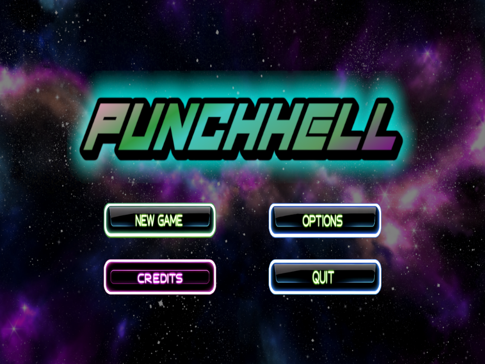
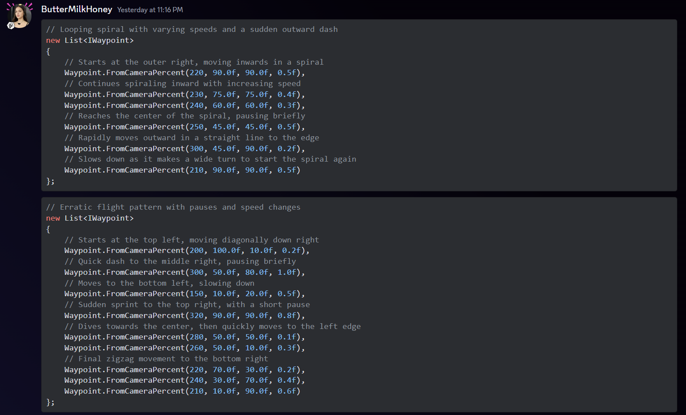
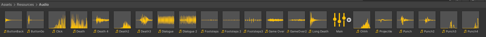
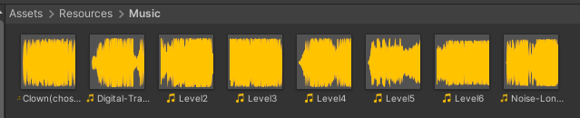

## Summary ##

PunchHell is a Touhou-style Danmaku (bullet hell) game, also known as a "shoot em' up." PunchHell takes inspiration and plays like many other shoot em' up games: a character is stationed on a stage that might appear to be scrolling vertically (or horizontally, as some games do it) and enemies spawn on the screen and approach the player's character in the stage. The enemies then spawn projectiles into the stage with varying behavior based on what sort of attacks that they were programmed to make. The player's goal is to dodge these bullets, kill the enemies with their own projectiles, and progress through the stages which present a variety of enemies to encounter and a variety of bullet patterns to dodge.

## Project Resources

[Web-playable version of your game.](https://itch.io/)  


[Trailor](https://extraconcentratedjuice.github.io/PunchHellPressKit/punchhell.mp4)  


[Press Kit](https://extraconcentratedjuice.github.io/PunchHellPressKit/) [Source](https://github.com/extraconcentratedjuice/PunchHellPressKit/)


[Proposal: make your own copy of the linked doc.](https://docs.google.com/document/d/1qwWCpMwKJGOLQ-rRJt8G8zisCa2XHFhv6zSWars0eWM/edit?usp=sharing)  

## Gameplay Explanation ##

**In this section, explain how the game should be played. Treat this as a manual within a game. Explaining the button mappings and the most optimal gameplay strategy is encouraged.**

The gameplay is similar to traditional Danmaku games.

The player is able to move with directional keys as input. That is, movement is accomplished through the classic keys that we have all grown to know and love:

- W: Move up
- A: Move left
- S: Move down
- D: Move right
- ESC: Pause game

And as in many other bullet hell games, there are also gameplay elements which change how the player moves and interacts with the game. These gameplay elements, and their corresponding input keys, are enumerated as follows:

- *Player Shoot*; Input: Fire1/LClick. The player can fire projectiles from a turret. There can be multiple turrets, as later described in the Score section. Player bullets damage enemy units, which have a limited amount of health.

- *Score*. A score counter is displayed on the bottom left corner of the screen, and increases under the following conditions: an enemy is killed (and subsequently having their on-screen bullets converted to a point drop), a bullet is grazed, a blue point drop is collected.

- *Power*. The player has one stream of projectiles at the beginning of the stage. Two additional "turrets" can be acquired by the player through collecting red power ups, which some enemies drop. The power ups fill the meter, and when the power meter is full, another turret is spawned, up to a maximum of 3.

- *Precise Movement*; Input: Fire2/RClick. At normal player movement speed, macro dodging of bullets is easy. However, when patterns start becoming complex and there is less space to dodge, the player can switch to slow movement mode with the Fire2 input. In slow movement mode, the character's movement speed slows and a precise hitbox is shown to facilitate micro doging.

- *Life*. The player has a fixed number of lives, which are lost if the player comes into contact with bullets. If there are no lives remaining, then the game ends and the player is forced to restart or quit the game. After death, a short period of invincibility is granted to the player to prevent chain deaths.

- *Graze*. When doging bullets, there are two hitboxes that a bullet could come into contact with: the core hitbox, which kills the player if touching a bullet, and the graze hitbox, which adds to the player's score for every bullet that remains in contact with it. Coming close to bullets in such a fashion is known as "grazing," and in this game also fills up the Roll Meter which is described subsequently.

- *Roll*; Input: SPACE. The player's character can "Roll" and gain a short period of invincibility and increased movement speed. The player can only roll when the Roll Meter, displayed as a white bar on the HUD, is full. The Roll Meter fills through grazing bullets.


**Add it here if you did work that should be factored into your grade but does not fit easily into the proscribed roles! Please include links to resources and descriptions of game-related material that does not fit into roles here.**

# Main Roles #

Your goal is to relate the work of your role and sub-role in terms of the content of the course. Please look at the role sections below for specific instructions for each role.

Below is a template for you to highlight items of your work. These provide the evidence needed for your work to be evaluated. Try to have at least four such descriptions. They will be assessed on the quality of the underlying system and how they are linked to course content. 

*Short Description* - Long description of your work item that includes how it is relevant to topics discussed in class. [link to evidence in your repository](https://github.com/dr-jam/ECS189L/edit/project-description/ProjectDocumentTemplate.md)

Here is an example:  
*Procedural Terrain* - The game's background consists of procedurally generated terrain produced with Perlin noise. The game can modify this terrain at run-time via a call to its script methods. The intent is to allow the player to modify the terrain. This system is based on the component design pattern and the procedural content generation portions of the course. [The PCG terrain generation script](https://github.com/dr-jam/CameraControlExercise/blob/513b927e87fc686fe627bf7d4ff6ff841cf34e9f/Obscura/Assets/Scripts/TerrainGenerator.cs#L6).

You should replay any **bold text** with your relevant information. Liberally use the template when necessary and appropriate.

## Producer - Konsing Ham Lopez

In my capacity as producer for our game PunchHell, I orchestrated the logistical aspects of the project, which included compiling progress reports, aggregating contributions from team members, and managing our GitHub repository. I facilitated resolution of Git-related challenges, providing guidance on stashing and pulling, and emphasizing the importance of these practices to my teammates. My role as the communication linchpin was challenging due to our varying schedules and the uneven distribution of workload among team members. 


Despite these challenges, we managed to rally in the final week, successfully bringing our game to completion. Beyond the conventional producer responsibilities, I took on a supportive role, assisting in various tasks such as image editing, crafting menu buttons and backgrounds, and programming the sound effects and music sliders/toggles and Quit Script. This effort included coding to ensure these elements were consistently functional and persisted across game sessions. 

 


I also contributed to the strategic design of enemy movements in levels 2-6, enhancing the gameplay structure established in the initial level. 

  

Reflecting on this journey, I recognize areas for improvement in my early producer role but also acknowledge the immense learning gained, which has equipped me for future leadership in game development. The project highlighted the critical importance of time management and effective communication, with a lesson learned on prioritizing the core game development over additional features.

## User Interface and Input - Ahmed Irtija


**Describe your user interface and how it relates to gameplay. This can be done via the template.**
For the game's UI, I wanted players to dive right into a space adventure vibe. I started off by setting up the [main menu](https://github.com/Konsing/ECS-179-Final-Project/blob/241156e60e15781521d02f81b1f8f216634f0bd9/PunchHell/Assets/Scripts/PunchHell/Menu/MainMenu.cs#L6C1-L17C2) with some cool buttons like 'New Game', 'Options', 'Credits', and 'Quit Game', all set against a galaxy-themed background. When you hit 'New Game', it takes you to the adventure's [level panel](https://github.com/Konsing/ECS-179-Final-Project/blob/4816c7c7b91c301848dff1db292c6193b8a926ac/PunchHell/Assets/Scripts/PunchHell/Menu/LevelMenu.cs#L7C1-L28C2) which is the first level in our game. 'Options' was kept simple for now, leading to a placeholder screen for sound settings up until our Producer/Audio, Konsing Lopez, added its functionality, while 'Credits' lays out who's behind the game magic which just has our names and roles, and 'Quit Game' just shuts down the game as the name suggests.


I then put together a level selector so players can jump to any of the six levels we designed, whcich you can see the scripts I created with the different waypoints for them and different enemies [here](https://github.com/Konsing/ECS-179-Final-Project/blob/4816c7c7b91c301848dff1db292c6193b8a926ac/PunchHell/Assets/Scripts/PunchHell/StageDefinitions.cs#L11C1-L322C2). This part needed a bit of extra coding with a levels menu script to get it all working smooth, each levels had its own enemies and movements for them with diffulty increasing as levels goes on. Then came the [victory](https://github.com/Konsing/ECS-179-Final-Project/blob/4816c7c7b91c301848dff1db292c6193b8a926ac/PunchHell/Assets/Scripts/PunchHell/Menu/VictoryScreen.cs#L7C1-L49C2) and [loser](https://github.com/Konsing/ECS-179-Final-Project/blob/4816c7c7b91c301848dff1db292c6193b8a926ac/PunchHell/Assets/Scripts/PunchHell/Menu/LoserScreen.cs#L7C1-L40C2) screens, which pop up based on your game outcome, using similar button setups for restarting, moving to the next level, or going back to the main menu, all of this were done in their respective scripts.


Working with Dan Le, our movement/physics guy, was the next step. We hashed out six unique levels, each with different movesets, making sure there was plenty of variety to keep things interesting. Along the way, I fixed a bunch of bugs, like levels not loading right or restart buttons not working or the panels not moving away from the screen.


All in all, the UI's got a massive role in setting the game's overall mood, with that retro 80s space feel shining through.


Best way to really get a good understand of the UI is playing the game itself.


**Describe the default input configuration.**
On the control side of things, we went for straightforward method:


- **WASD keys:** For moving around the place.
- **Fire 1 (left click):** Lets you blast away.
- **Fire 2 (right click):** Puts things in slow-mo, giving you some edge.
- **Space:** Pull off some cool rolls.
- **ESC:** Hits pause on the action.


**Add an entry for each platform or input style your project supports.**
We tailored the game for PC, sticking to the classic keyboard and mouse combo for all the in-game action. This setup fits like a glove with our game's quick-paced space theme and keeps things intuitive for players.


## Movement/Physics - Dan Le

**Describe the basics of movement and physics in your game. Is it the standard physics model? What did you change or modify? Did you make your movement scripts that do not use the physics system?**

Player and enemy movement is not done through the physics system. Player movement is done by modifying the position of the player's transform in the update loop when certain input keys are held. The movement for enemies is done similarly, by modifying the position of their transforms.

Enemy movement is scripted through a waypoint system: there are many (x,y) positions in a list, and enemies move along those positions every frame. Each waypoint has a certain speed at which the enemy moves to it, and a parameter for how long the enemy should remain at each waypoint. Enemy movement is similar to how player movement is done: that is, without physics and in the enemy's case using the MoveTowards vector function.

We do use physics for one thing, however: enemy drops. The powerup, point drop, and bullet point drop (which all enemy-fired projectiles are converted to when the enemy is killed), use Rigidbody2D as an easy method of giving their movement some character. The bullet point drop homes on to the player's character using Rigidbody2D physics.

Projectile movement is done through the DanmakU library, which provides easy creation and management of projectiles with various parameters such as speed, direction, and angular speed. Projectile patterns are composable; one can have the enemy fire a pattern that is a line of bullets, and then compose that into a ring of line of bullets, an arc of line of bullets, a circle of a line of bullets, and so on. Movement of projectiles is done by the library without the use of Unity physics for better performance characteristics. In fact, the bullet sprite rendering, movement, and bullet collision are handled manually by the library and do not involve many Unity movement or physics subsystems. In fact, they don't even have their own GameObjects. Projectile collision does involve the use of a Collider2D, but DanmakU makes use of only the bounding boxes of these colliders and of the Physics.CircleCastNonAlloc to check for projectile collisions.

**Game Engines and Abstraction, Third-Party Code** - It would be pretty difficult to write a game completely from scratch handling all aspects of the game such as physics, audio, rendering, and math. This class teaches that it is useful and easy to use game engines and make use of abstractions, perhaps made by somebody else, to save time on game development. We considered using a "Danmaku Engine" called "danmokou" built on top of Unity that would set up a scene and handle a lot of the bullet hell base for us, but decided that it did too much. Thus, we resorted to using the "DanmakU" library, which makes generating projectiles in patterns easier and performant due to its use of the Unity Jobs system and close-to-native code. This is an example of an abstraction and/or component of a game engine being put to use. Think about the flaming circles students would have to jump through if not allowed the use of a game engine or third party code in completing this project. Although, we did experience some issues with the buginess and issues encountered when using DanmakU, which is a reminder of one of the tradeoffs of not rolling it yourself. [DanmakU's inclusion in our project](https://github.com/Konsing/ECS-179-Final-Project/tree/main/PunchHell/Assets/Scripts/DanmakU/Runtime). [DanmakU library on GitHub](https://github.com/james7132/DanmakU)

## Animation and Visuals - Jack Sangiamputtakoon

**List your assets, including their sources and licenses.**

- [Layer AI](https://www.layer.ai/) - Used for image generation
- [Krita](https://krita.org/en/) - used for editing the images

**Describe how your work intersects with game feel, graphic design, and world-building. Include your visual style guide if one exists.**

**Visual Style**
Since our game was inspired by 80s asthetics, I wanted to create a neon pixelated 80s look. The pixelated 16-bit art style was for both simplicity and was in line with the game feel. Since I am not an artist I used AI image generation to create a backbone of my work, which I then edited in Krita, an image editing software. I often used references that Zach, the gameplay designer outlined which I then implemented. Here you can see Zach drawing up the health system
 

which I then implemented 

 

Other times I took more liberty with Zach's outlines. 

 

Of course, most of the time the generated images did not turn out perfectly


so I had to touch it up. 


Another small thing I did was resize the images. As a team we decided to make certain sprites a certain size for consistency. For example, we decided to make all of the projectilels 128 x 128 pixels. We made them a consistent size in order to expedite the gameplay side, so that Dan would not have to constantly resize the sprites in Unity. 

**Animation System**

Due to the simplicity of the shoot-em up, we had very little animation, and what was there was often very simple transitionary frames. For example, I had a very basic animation for the laser, as it goes from low to full strength.

  

In terms of coding the visuals the main thing I did was try to create changing backgrounds based on the state of the game. Originally we had a black screen which we found to be boring. So we wanted the background to change based on When there is a story/dialogue segment we planned for the background to change according to the plot. 
## Game Logic

**Document the game states and game data you managed and the design patterns you used to complete your task.**

### The section below this header was authored by Dan Le who was on Movement/Physics but due to relative technical aptitude also substantially contributed to Game Logic.


UI game state is handled in two ways: scene separation and UI GameObject hiding/showing. The state of the title screen is handled in a separate scene and mostly does not relate to the state of the game itself. 

The state of the playing stage is kept in a StageManager class. Parameters such as lives remaining, score, power level, roll level, invincibility time, roll time, and current stage progress are saved in this class. When such parameters are modified, StageManager ensures that the UI and gameplay is kept in sync to reflect the parameters. I.e., when LivesRemaining is modified, if it is 0, then the StageManager will ensure that the proper game over UI elements are shown to the user. If ifPaused is modified through player input, then the StageManager ensures to freeze and unfreeze the game accordingly, and show the pause menu to the user. The transitions and actions taken on changes to state such as LivesRemaining and Level are handled through C# property getters and setters, so that for instance setting StageManager.Instance.Level = 1 will also change dependent state necessary for the level to be level 1.

Stage progress is modified and facilitated by the StageActionManager class, which keeps a list of StageActions and a coroutine running that iterates through the list, "progressing" through the stage by spawning enemies, delaying spawns, initiating dialogue, and waiting for enemy clear. A StageAction could be best implemented as a discriminated union (think Rust unions), but since C# has no such feature, the functionality is emulated using an abstract class StageAction and concrete classes such as StageSpawnAction and StageDialogueAction inheriting from StageAction. A coroutine keeps an index starting at 0 and iterates through the list of StageAction, checking if they are instances of concrete subclasses as described previously and taking the correct action. Dialogue "freezes" the stage progression until it is finished. Enemies are spawned, and then the coroutine waits for the next entry, depending on if there is a wait time needed for the current entry. The stage action manger can wait until all enemies are cleared before progressing.

Projectiles are managed by the DanmakU library, but documentation was lacking, and so some reading into the source code was required to interface properly with it. The collision is handled through an Event system and design pattern, with a DanmakuCollider component emitting an event that must be captured by the GameObject using it. There was some difficulty with a rendering issue that DanmakU had, and required some prying into the library and a couple of changes had to be made to fix these bugs. Additionally, there was no documentation on how to handle collisions and the library did not include a method of filtering collisions by layer, which necessitated looking into the code to discover that a bullet's "Pool" can be compared with the player's bullet "Pool" to ensure that enemies are only damaged by player bullets.

The two important singletons used in the game are the StageManager singleton, accessible through StageManager.Instance, and the Player singleton, accessible through PlayerController.Instance. These singletons allow for easy access to both the stage and player from any related game elements that may require access to them.

**Design Patterns** - Design patterns happened to be mentioned tons in this course, and as described previously, some wered used in the development of the game logic. Notably, the use of singletons in [PlayerController](https://github.com/Konsing/ECS-179-Final-Project/blob/main/PunchHell/Assets/Scripts/PunchHell/PlayerController.cs) and [StageManager](https://github.com/Konsing/ECS-179-Final-Project/blob/main/PunchHell/Assets/Scripts/PunchHell/StageManager.cs), the use of the C# equivalent of a tagged enum achieved through inheritance in [StageActionManager](https://github.com/Konsing/ECS-179-Final-Project/blob/main/PunchHell/Assets/Scripts/PunchHell/StageActionManager.cs) and the idea of an "action queue" handled asynchronously. An interface was also used to define [Waypoints](https://github.com/Konsing/ECS-179-Final-Project/blob/main/PunchHell/Assets/Scripts/PunchHell/Waypoint/IWaypoint.cs) to allow for two concrete implementations: a WaypointObject editable in the Unity Editor for quick testing, and a Waypoint data class used to instantiate waypoints in code. The limitations of Unity are apparent here in not being able to select a dataclass as an IWaypoint. We also made use of the Event/Observer design pattern [as consumers](https://github.com/Konsing/ECS-179-Final-Project/blob/main/PunchHell/Assets/Scripts/PunchHell/GrazeHitboxController.cs) of a library that implemented them.

*What I wanted to do, but couldn't (due to time constraints imposed by my own procrastination and laziness)* - To script the stage, that is, to decide which enemies to spawn, where they move, what they fire, when they spawn and the dialogue interactions in between, I was going to develop a **Domain Specific Language** that would allow one to easily create a reloadable sequence of actions that script the stage without having to keep it all in C# code, which as you may be aware of, causes Unity engine to RELOAD DOMAIN.... COMPLETING DOMAIN.... every time it is changed, which was a signifigant annoyance during development. Such a DSL would look like this:

```
DialogueAction("Name", "Some dialogue")
SpawnEnemy(EnemyA, (400, 1320), Waypoints1)
Wait(1)
SpawnEnemyWave(EnemyA, (400, 1320), Waypoints2)
```
or similar. What we have is this in C#:
```
private static List<StageAction> GetLevel1()
    {
        var enemyAWaypoints = new List<IWaypoint>
        {
                Waypoint.FromCameraPercent(250, 90.0f, 90.0f),
                Waypoint.FromCameraPercent(250, 75.0f, 90.0f),
                Waypoint.FromCameraPercent(250, 40.0f, 70.0f),
                Waypoint.FromCameraPercent(250, 20.0f, 60.0f),
                Waypoint.FromCameraPercent(250, 50.0f, 65.0f)
        };

        return new List<StageAction>
        {
                new StageActionSpawn("Enemies/EnemyBase", new Vector3(640, 720, 0)),
                new StageActionDialogue("Player", "I am so sick and tired of this shit"),
                new StageActionDialogue("Enemy", "Me too dude"),
                new StageActionDelay(5.0f),
                new StageActionSpawn("Enemies/EnemyA", new Vector3(1100, 1100, 0), enemyAWaypoints),
                new StageActionDelay(2.5f),
                new StageActionSpawn("Enemies/EnemyA", new Vector3(1100, 1100, 0), enemyAWaypoints),
                new StageActionDelay(2.5f),
                new StageActionSpawn("Enemies/EnemyA", new Vector3(1100, 1100, 0), enemyAWaypoints),
                new StageActionDelay(2.5f),
                new StageActionWaitForClear()
        };
    }
```
which is similar but does not provide the brief convenience and reloadability of a script written in a DSL designed for bullet hell games. I also wanted to create an editor tool that would allow a developer to drag along the screen to define a list of waypoints instead of painstakingly entering them in one by one into a list.
## The Zack of all Trades

**Document the game states and game data you managed and the design patterns you used to complete your task.**

### The section below this header was authored by Zachary Van Vorst who was responsible for Gameplay Logic design, however due to frequent miscommunication and the group's late start (due to finals, test, etc), became a sort of jack of all trades
The awkward label is due to the unique circumstances regarding my own contributions. I do not wish to blame my group for the final result, only that I get evaluated on the effort I put into the project. I split this description into four phases: the work that has been represented within the game itself, the work I did, the work I did...again, and the descrepency between them.
**The work represented in the game**

Code for the dialogue I did.
 
Mission 1 Dialogue - https://github.com/Konsing/ECS-179-Final-Project/blob/18c2420411d5870f3837934bc36b88224158934b/PunchHell/Assets/Scripts/PunchHell/StageDefinitions.cs#L33

Mission 2 Dialogue - https://github.com/Konsing/ECS-179-Final-Project/blob/18c2420411d5870f3837934bc36b88224158934b/PunchHell/Assets/Scripts/PunchHell/StageDefinitions.cs#L84

Mission 3 Dialogue - https://github.com/Konsing/ECS-179-Final-Project/blob/18c2420411d5870f3837934bc36b88224158934b/PunchHell/Assets/Scripts/PunchHell/StageDefinitions.cs#L125

Mission 4 Dialogue - https://github.com/Konsing/ECS-179-Final-Project/blob/18c2420411d5870f3837934bc36b88224158934b/PunchHell/Assets/Scripts/PunchHell/StageDefinitions.cs#L161

Mission 5 Dialogue - https://github.com/Konsing/ECS-179-Final-Project/blob/18c2420411d5870f3837934bc36b88224158934b/PunchHell/Assets/Scripts/PunchHell/StageDefinitions.cs#L174

Mission 6 Dialogue - https://github.com/Konsing/ECS-179-Final-Project/blob/18c2420411d5870f3837934bc36b88224158934b/PunchHell/Assets/Scripts/PunchHell/StageDefinitions.cs#L189

The abstract elements are mainly menus, Gameplay UI Examples, Dialogue exchange Design, Buttons, Player Sprite

Directory containing description and or examples of each abstract element:

Menus - https://github.com/Konsing/ECS-179-Final-Project/tree/main/PunchHell/Documents/Menus

Gameplay UI Examples - https://github.com/Konsing/ECS-179-Final-Project/tree/main/PunchHell/Documents/Gameplay%20UI%20examples

Dialogue Exchange Design - https://github.com/Konsing/ECS-179-Final-Project/tree/main/PunchHell/Documents/Dialogue%20Exchange%20Design

Buttons - https://github.com/Konsing/ECS-179-Final-Project/tree/main/PunchHell/Documents/Buttons

Player Sprite - https://github.com/Konsing/ECS-179-Final-Project/tree/main/PunchHell/Documents/Player


**The work I did (excluding the above)**
The group initially decided on a bullethell/light novel format for the game, with heavy emphasis on the variety of enemies, level design, and story. As the gameplay designer, I designed different enemies, attack patterns, level designs, abilities, menus, sprites, menus, and just about every aspect of the game itself on my own. I included video examples from other similar games to reference, sprites, examples of the backgrounds, how I wanted the font to look like, the general theme for visual design and audio queues. I frequently asked for questions regarding feedback and questions, however due to the group being busy with other classes, I continued my work, taking the collective silence as agreement.

Here are a few examples of my early designs:

Rough sketch of the story - https://github.com/Konsing/ECS-179-Final-Project/blob/main/Documents/Story.pdf

Rough sketch of gameplay mechanics - https://github.com/Konsing/ECS-179-Final-Project/blob/main/Documents/179_Gameplay_240229_155625.pdf

Initial story document containing level designs - https://docs.google.com/document/d/1p2P99ieAFLnA-otmrhpaOJq8ouLhLcdBULgW5sqo8cI/edit?usp=sharing

Initial enemy design and projectile patterns - https://github.com/Konsing/ECS-179-Final-Project/blob/main/Documents/MechanicsDraft/Boss%20and%20Enemy%20Variants.pdf

I made a guide for the group to build the framework of the game - https://docs.google.com/document/d/1RliyboyAL2Pkde6kl9ltIv3SLjySaK0Jqm7ZtEzv4bo/edit?usp=sharing

Asking for feedback and questions - https://github.com/Konsing/ECS-179-Final-Project/blob/main/PunchHell/Documents/Evidence%20of%20Producer%20role/Screenshot%202024-03-22%20142955.png

Needless to say, the initial conception of almost every aspect of the game (except the decision on the genre and theme of the game) came from me. I also acted as the producer in this initial state, contacting and representing my group during peer review.

Discord message - https://github.com/Konsing/ECS-179-Final-Project/blob/main/PunchHell/Documents/Evidence%20of%20Producer%20role/Screenshot%202024-03-22%20143018.png

Ultimately, many features were either not implemented or only only partially implemented. Here is a list of a few of them (others can be found in the directory: https://github.com/Konsing/ECS-179-Final-Project/tree/main/PunchHell/Documents)
-The 10,000 word plot and gameplay design
-the stages of implementation
-Enemy and boss designs
-level designs
-player abilities
-projectile mechanics
-sound designs
-background style
-Mission UI format

**Work I did...again**
Unfortunately, by the time the group had finished with other classes, the depth of the game became too overwhelming to handle within the remaining timeframe. Due to many sudden complaints of misunderstanding and miscommunication, I reworked the game from the ground up with more simplicity. I contributed a lot more to other roles in reworking the game, including sprite design and UI. Again, most of my unused designs and descriptions are found within any folder within the Documents Directory.

Simpiler story - https://github.com/Konsing/ECS-179-Final-Project/tree/main/PunchHell/Documents/Plot

Example sprites - https://github.com/Konsing/ECS-179-Final-Project/tree/main/PunchHell/Documents/Enemies

Game mechanics similar to my own designs (for example) - https://github.com/Konsing/ECS-179-Final-Project/blob/main/PunchHell/Documents/Enemies/Bosses/Pinwheel%20attack.mp4

Simple level design - https://github.com/Konsing/ECS-179-Final-Project/tree/main/PunchHell/Documents/Mission%20Level%20Design

Background images - https://github.com/Konsing/ECS-179-Final-Project/blob/main/PunchHell/Documents/Menus/background%20example.png

Health -  

Projectile image - https://github.com/Konsing/ECS-179-Final-Project/blob/main/PunchHell/Documents/Projectiles%20and%20Projectile%20Mechanics/Normal/Screenshot%202024-03-10%20212822.png

asking for more feedback - https://github.com/Konsing/ECS-179-Final-Project/blob/main/PunchHell/Documents/Evidence%20of%20Producer%20role/Screenshot%202024-03-22%20143106.png

**Why other gameplay Mechanics were implemented (The descrepency between design and implementation)**
The group began coding within too short a time before submission, and failed to implement my remade designs, ideas, and work due to relying on an inflexible framework for bullethells: "Danmaku". Cornered, we cobbled together what little mechanics the Danmaku framework/library supported regardless of my designs. By this time, I had spent so much time on the narrative that I didn't have time to code (except for adding all the narrative) and worked on other finals.

**Comment from Dan on the preceding point**: Danmaku is not an "inflexible" framework. If you know what it actually does, you will realize that it allows for greater flexibility due to the composable nature of the patterns it supports, along with the ability to implement bullet modifiers to allow for acceleration and homing. It is a very barebones library and the "inflexibility" that you describe is the result of using their example bullet patterns as a placeholder for when I would develop actual bullet scripting. The real inflexibility is in the time constraint that I had in developing scriptability for bullets in the same manner that StageActionManager scripts the stage. This is not a framework issue.

# Sub-Roles

## Audio - Konsing Ham Lopez

In my role focusing on the game's audio, I curated a selection of sound effects and music that aligned with PunchHell's dynamic and immersive atmosphere. The sound effects, sourced from Freesound.org and Pixabay, ranged from the mechanical whir of ship engines to the high-energy blasts of weapons fire. The music, collected from Pixabay and Free Music Archive, was exclusively in a cyberpunk style, characterized by its high-energy and futuristic tones, to match the game's fast-paced and intense gameplay.

 

 

To ensure players could personalize their audio experience, I implemented volume sliders and toggles for the music and sound effects, which were integrated into the game through the VolumeSettings.cs script. This script was connected to a sound mixer named Main, which was tied to every sound game object source within the game. This setup meant that adjusting the sliders for SFX or Music dynamically altered the audio levels across all levels and even the title screen, providing a seamless and consistent experience.

 

Additionally, the sound effects player script was designed to manage three distinct button sounds in the main menu, ensuring that each interaction felt responsive and satisfying. The VolumeSettings script, on the other hand, managed all the audio toggles and sliders, offering players a comprehensive control over their audio experience. Changes were also made to the StageManager.cs script to facilitate the transition between songs as players progressed through levels. An issue initially arose where the music would only play when selecting 'restart' or 'new game,' but this was rectified by updating the method in the StageManager script, ensuring that music would play correctly from the beginning of each session. The stagemanager contains a list that holds all 6 tracks and changes between them depending on the level.

  

  


## Gameplay Testing

**Summarize the key findings from your gameplay tests.**

We found feedback to be surprisngly positive, with many people unfamiliar with the bullet hell genre and intrigued by its mechanics and chaotic looking screen. The main takeaway that our team found from the playtesters was that our game was hard. Very hard. That does make sense since our game was designed to be a bullet hell, a genre known for its unforgiving nature and its trial and error approach. However, we felt that if our game was too hard then it would not be very approachable and would lessen the desire to replay. Thus we decided to make the first two levels easier in order to encourage beginners to keep playing and feel a sense of progress. Another thing we noticed was that peopel often did not notice when they got hurt, so we decided to make that more obvious. Lastly, we had to explain the game mechanics in person, as our game was not as intuitive as we had hoped. Therefore we added a short but informative "how to play" tutorial at the beginning of the game.


## Narrative Design

**Document how the narrative is present in the game via assets, gameplay systems, and gameplay.**

**By Zachary Van Vost**

As mentioned within "Zack of all Trades", most of my plot and gameplay was scrapped (10,000 words btw). Originally the player would be a highschooler dealing with a corrupt company and the spread of a malicious failed drug. The boss and enemies would be humans who fire fists out. Bosses would be a funny suit or security guards. Links:

The initial sketch of the plot - https://github.com/Konsing/ECS-179-Final-Project/blob/main/Documents/Story.pdf

near-final draft - https://docs.google.com/document/d/1p2P99ieAFLnA-otmrhpaOJq8ouLhLcdBULgW5sqo8cI/edit?usp=sharing

**The final design of the story**

Massively simplifying the story, the narrative now closely follows the theme of rolling with the punches with the main character Jose. Jose is a janitor working for the big bad evil guy, Boss Boss, until one day he gets an unexpected promotion. He is now commander of an entire army of boxer robots, the only problem being that he immediately loses control of all of them when the boss spills coffee on the way out of the office. Unbeknownst to the entire organization, Jose is assaulted by the robot army. Just as Jose thinks he can get some respit, the company take notice of him. Being a relatively unknown element within the company, the staff assault him alongside the robots. Once again, he proves to be triumphant until Boss Boss returns and tries to kill him. Jose proves victorious. He is tired. He wants to go home. Suddenly the person who was originally supposed to stand against the big bad evil guy shows up and they duke it out. Jose once again wins!

Each mission has a dialogue segmment displaying a portion of the story before the stage begins with backgrounds, a canvas with who is speaking, and appropriate music. As missions progress, enemies get more technical. The robots are getting stronger and shoot faster, adapting to a more brutal fighting style.

Dialogue box - https://github.com/Konsing/ECS-179-Final-Project/blob/main/Documents/Screenshot%202024-03-22%20154617.png

Original layout design - https://github.com/Konsing/ECS-179-Final-Project/blob/main/PunchHell/Documents/Dialogue%20Exchange%20Design/Screenshot%202024-03-11%20154457.png

link to plot documents (each folder contains each mission's dialogue exchange) - https://github.com/Konsing/ECS-179-Final-Project/tree/main/PunchHell/Documents/Plot

Enemies are robotic and adopt to this future sci-fi style - https://github.com/Konsing/ECS-179-Final-Project/blob/main/PunchHell/Documents/Enemies/Basic/Screenshot%202024-03-10%20210358.png

The font style and buttons are neon and bright - https://github.com/Konsing/ECS-179-Final-Project/blob/main/PressKit/PunchHell.png

You really FEEL like you're getting assaulted by an army of robots - https://github.com/Konsing/ECS-179-Final-Project/blob/main/PunchHell/Documents/Screenshot%202024-03-22%20160300.png

Projectiles are shaped like punches because Jose, the main character, is fighting for his life - https://github.com/Konsing/ECS-179-Final-Project/blob/main/PunchHell/Documents/Screenshot%202024-03-22%20160300.png

By being the gameplay designer and narrative designer it allowed me to essentially take full creative responsibility for the style and design which had a nice synergy, hence why I was able to collaborate with other memebers so well to keep the narrative so consistent.


**Final Implementation of the story**
Each mission contains a Dialogue canvas with a DialogueText, DialogueName, and DialogueSounds. If there is another dialogue segement after the user presses the mouse button, the dialogue changes to the next set of DialogueText, DialogueName, and DialogueSounds, if there exists more to show. If there are no more dialogue segments to show, the mission starts.

Font is Tektur-Regular (font) size 16

The name, DialogueName, is bold and size 32 to differentiate the name from the text a bit.

**Tutorial**

In addition to the plot segments in mission 1, I also added a tutorial segment introducing the basic layout to the player such as which buttons do what, the objective, etc.


## Press Kit and Trailer

**Include links to your presskit materials and trailer.**

**Describe how you showcased your work. How did you choose what to show in the trailer? Why did you choose your screenshots?**

## Game Feel and Polish

**Document what you added to and how you tweaked your game to improve its game feel.**
To really nail the game feel, I took a hands-on approach, diving into every new feature we added one at a time. I believe getting into the player's shoes is crucial to understand and refine the game's vibe, so I made sure to play through each change myself.


Starting with the menus, I saw that players would benefit from having more control right after a game round. So, I added a restart option on both the loser and victory screens, allowing players to jump straight back into the action without unnecessary delays. Additionally, I put in a 'New Game' button to give players a quick way to reset the levels and start fresh, enhancing the game's flow and user experience.


Digging deeper into the gameplay, I focused on the level difficulty and overall challenge. It felt crucial to get this balance right for players seeking a good thrill. By modifying the enemy prefabs, I adjusted their health bars and movement patterns. These changes weren't just random; they were carefully created by checking after every update, making the game tougher and more engaging for those who crave a challenge.


These tweaks had a visible impact, not just on the game's appearance but also on its playability and feel. By methodically testing and adjusting each element, I believe we significantly enhanced the overall game experience, making it more fun and rewarding for players.

